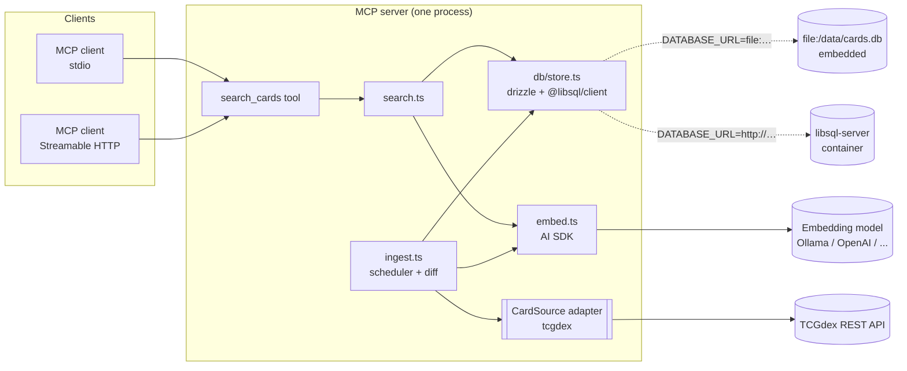
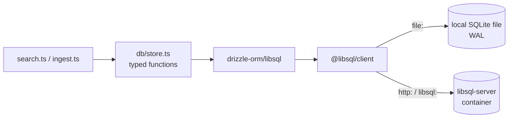
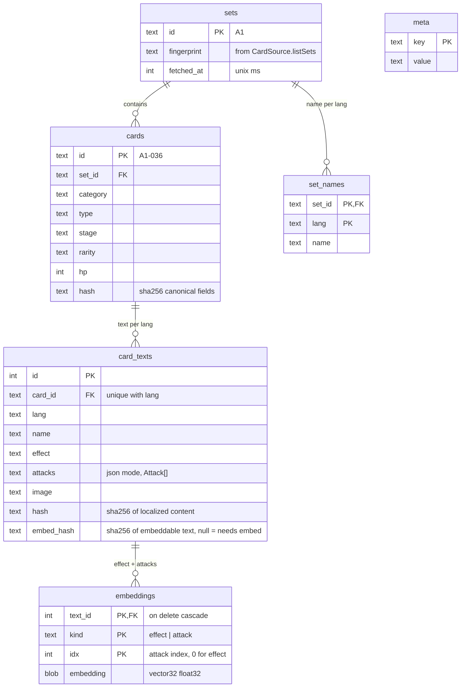
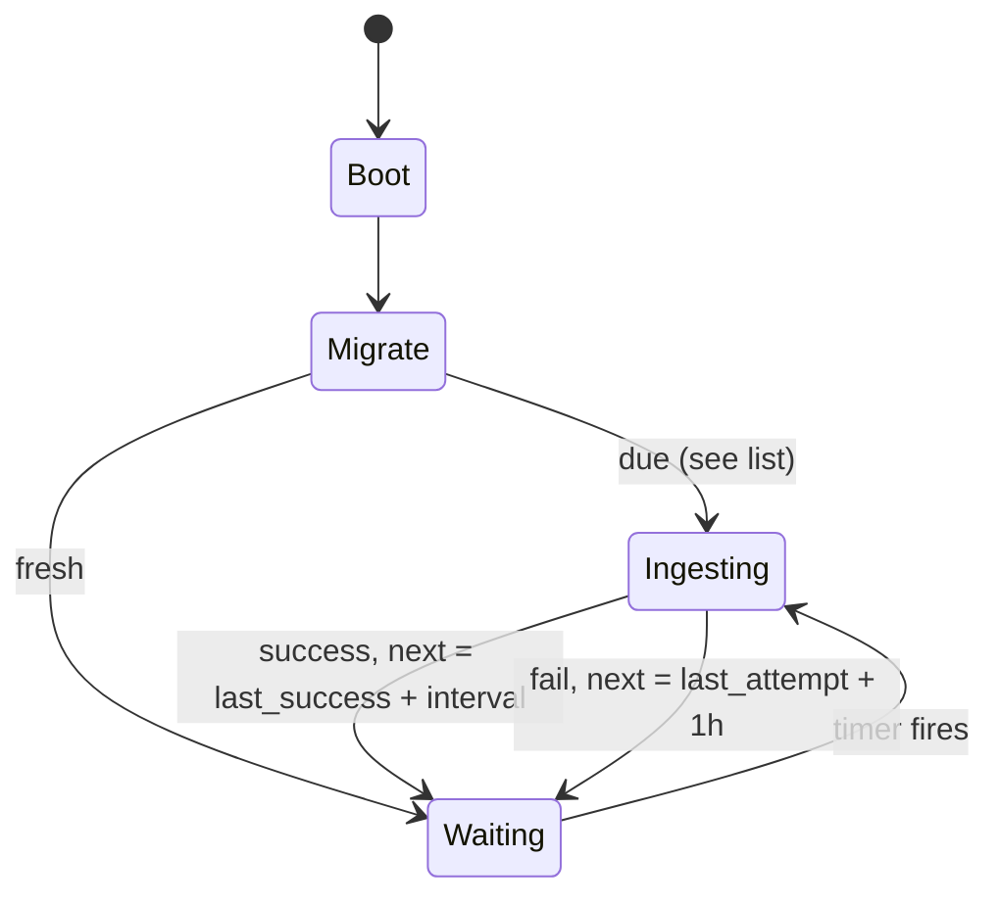
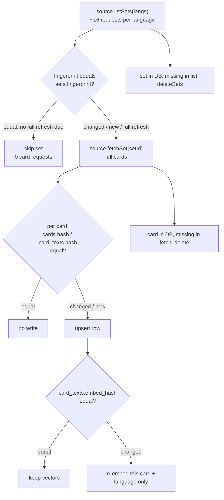
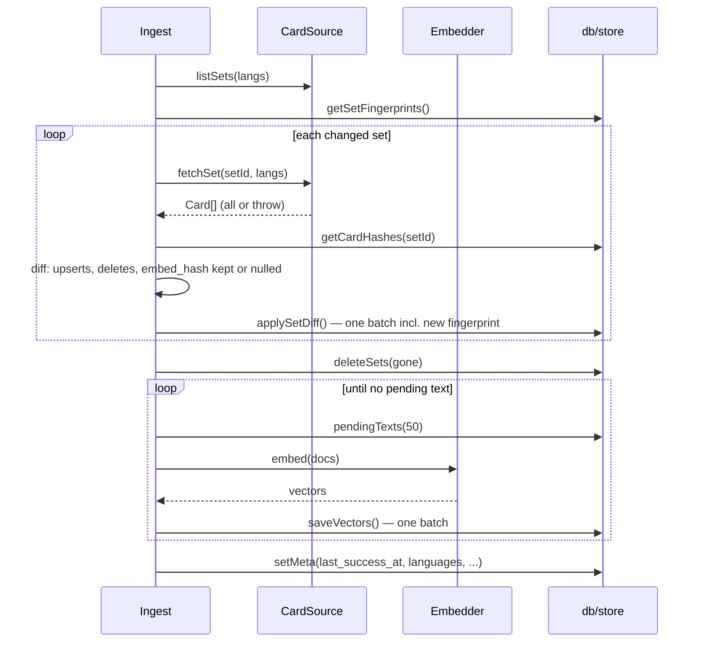
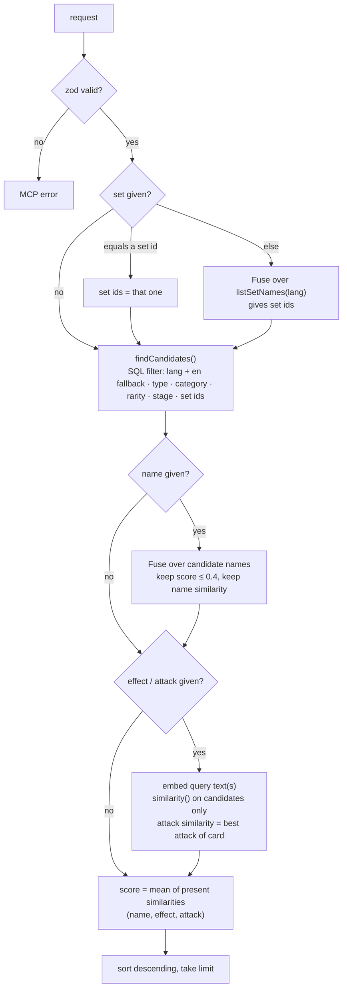
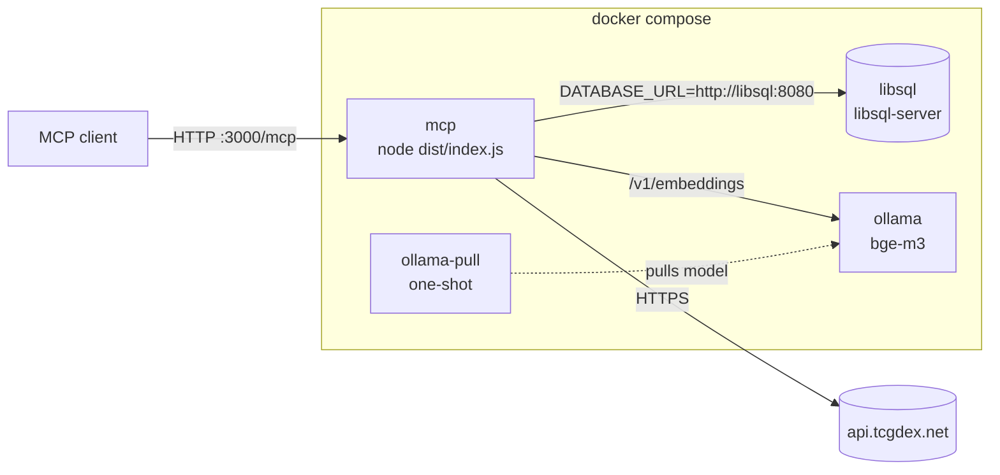

# Pokémon TCG Pocket MCP — Design

MCP server for Pokémon TCG Pocket card search. Fetches card data by itself on interval. Supports multiple languages. Runs in Docker.

> [!NOTE]
> Status: v5, implemented. Written 2026-09-19. Decisions from Q&A with owner in [Decisions](#decisions). Implementation deviations from draft v4 in [Implementation notes](#implementation-notes). No open questions left.

## Goal

- One MCP tool: `search_cards`. All filters optional. Empty field matches all.
- Ingest (data update) runs on interval. Interval survives restart. No ingest yet: ingest on start.
- Ingest writes only changed data. Hash per set and per card. No wipe.
- Data source is swappable adapter. First adapter: [TCGdex](https://tcgdex.dev).
- Database: libSQL. Embedded file or separate container, picked by `DATABASE_URL`. One schema, one migration folder.
- `LANGUAGES` env var picks languages. Ingest pulls those plus `en`. Every request must name its language. Card missing in requested language falls back to `en`.
- Docker Compose runs MCP server, libSQL server (DB), Ollama (embeddings).

Not goals: deck builder, prices, meta stats, local image storage.

## Stack

TypeScript everywhere. Compiled with `tsc`. Real TS `enum`s.

| Part            | Pick                                                                   | Reason                                                                                                  |
| ---------------- | ------------------------------------------------------------------------ | ---------------------------------------------------------------------------------------------------------- |
| Runtime         | Node 24 LTS                                                            | Current LTS.                                                                                            |
| Language        | TypeScript, `tsc` build to `dist/`                                     | Full TS. Enums, strict mode.                                                                            |
| Dev runner      | `tsx`                                                                  | Runs and watches `src/*.ts` without build, for dev and tests.                                           |
| MCP             | `@modelcontextprotocol/sdk`                                            | Official SDK. stdio and Streamable HTTP.                                                                |
| Schema          | `zod` v4                                                               | MCP SDK uses it. `z.enum()` accepts TS enums directly.                                                  |
| DB              | libSQL via `@libsql/client`                                            | SQLite fork. Same client talks to local file **and** remote `libsql-server`. Built-in vector functions. |
| ORM, migrations | `drizzle-orm` (`drizzle-orm/libsql`) + `drizzle-kit` (dialect `turso`) | Typed queries. SQL migrations generated from one TS schema.                                             |
| Embeddings      | Vercel AI SDK `ai` + `@ai-sdk/openai` + `@ai-sdk/openai-compatible`    | Admin picks model by env var. API or local (Ollama), same code.                                         |
| Fuzzy match     | `fuse.js`                                                              | Few thousand names. In-memory fuzzy match is enough.                                                    |
| Lint            | ESLint 10 flat config + `typescript-eslint`                            | Type-aware lint. Pins TypeScript to 6.x: `typescript-eslint` does not support TS 7 yet.                 |
| Format          | Prettier                                                               | No style debates.                                                                                       |
| Package manager | pnpm                                                                   | Already in `package.json`.                                                                              |

> [!NOTE]
> Why not Postgres: data is small (~16k text rows plus vectors, < 200 MB). One writer (ingest), many readers (search). SQLite WAL mode fits exactly. Postgres wins only with many MCP replicas on many hosts, or other apps sharing the DB. Not a goal now.
>
> Why libSQL, not plain SQLite: one client for file **and** network container. Embedded or container is a URL choice, not two code paths. Native vectors, no `sqlite-vec` extension loading.

> [!WARNING]
> libSQL is a Turso fork, less proven than stock SQLite. Turso focuses on its Rust rewrite. libSQL repo is still active (last push 2026-09-16). If libSQL dies: switch to `better-sqlite3` + `sqlite-vec`. Same SQL dialect, same drizzle schema except vector read/write helpers. Only `db/client.ts` changes. Server mode is lost; embedded only.

## Overview



Two paths only. Search path reads store. Ingest path writes store. Both use `embed.ts`. Only `src/db/` touches SQL.

## Config

All config lives in env vars. No CLI flags. List values are comma-separated; each value is one option, so combinations need no extra enum member.

| Var                                    | Default / example                                      | Meaning                                                                                                     |
| --------------------------------------- | ------------------------------------------------------ | --------------------------------------------------------------------------------------------------------- |
| `LANGUAGES`                            | `en` / `en,de,fr`                                      | Languages to ingest and serve. Each must be in `CardSource.languages`, else startup fails.                  |
| `TRANSPORTS`                           | `stdio` / `stdio,http`                                 | Transports to start. Values: `stdio`, `http`. Both listed: both run in one process.                         |
| `PORT`                                 | `3000`                                                 | HTTP port. Used when `TRANSPORTS` includes `http`.                                                          |
| `HOST`                                 | `127.0.0.1`                                            | HTTP bind address. Docker image sets `0.0.0.0`.                                                             |
| `DATABASE_URL`                         | `file:./data/cards.db` (default), `http://libsql:8080` | DB location. `file:` is embedded. `http(s):` or `libsql:` is libsql-server (or Turso cloud).                |
| `DATABASE_AUTH_TOKEN`                  | `eyJ...`                                               | JWT for libsql-server with auth enabled. Empty means no auth.                                               |
| `EMBEDDING_MODEL`                      | `openai:text-embedding-3-small`, `compatible:bge-m3`   | `<provider>:<model>`. Provider is `openai` or `compatible`.                                                 |
| `EMBEDDING_BASE_URL`                   | `http://ollama:11434/v1`                               | For `compatible`. Ollama, LM Studio, vLLM, llama.cpp all serve OpenAI `/v1/embeddings`.                     |
| `EMBEDDING_API_KEY` / `OPENAI_API_KEY` | `sk-...`                                               | Key, if provider needs one.                                                                                 |
| `CARD_SOURCE`                          | `tcgdex`                                               | Which `CardSource`.                                                                                         |
| `UPDATE_INTERVAL_HOURS`                | `24`                                                   | Ingest interval.                                                                                            |
| `FULL_REFRESH_DAYS`                    | `7`                                                    | How often ingest ignores set fingerprints and re-checks every card (catches errata). See [Ingest](#ingest). |

`config.ts` parses all env vars once with zod. Invalid config fails at startup with clear message. List parsing:

```ts
const csv = <T extends z.ZodType>(item: T) =>
  z
    .string()
    .transform((s) => [
      ...new Set(
        s
          .split(',')
          .map((v) => v.trim())
          .filter(Boolean),
      ),
    ])
    .pipe(z.array(item).min(1));

const env = z.object({
  LANGUAGES: csv(z.string()).default(['en']), // checked against source.languages after parse
  TRANSPORTS: csv(z.enum(Transport)).default([Transport.Stdio]),
  PORT: z.coerce.number().int().min(1).max(65535).default(3000),
  HOST: z.string().default('127.0.0.1'),
  // DATABASE_URL, EMBEDDING_*, ... same pattern
});
```

> [!WARNING]
> Multiple languages need a **multilingual** embedding model. Good: `bge-m3` (Ollama), `text-embedding-3-small`, `multilingual-e5-*`. Bad: `nomic-embed-text`, mostly English, weak for `de`/`fr` queries.

`embed.ts` sketch:

```ts
import { embedMany } from 'ai';
import { createOpenAI } from '@ai-sdk/openai';
import { createOpenAICompatible } from '@ai-sdk/openai-compatible';
import { config } from './config.js';

const [provider, ...rest] = config.EMBEDDING_MODEL.split(':');
const modelId = rest.join(':'); // ollama tags have ':' too, e.g. bge-m3:567m

const model =
  provider === 'openai'
    ? createOpenAI({ apiKey: config.EMBEDDING_API_KEY ?? config.OPENAI_API_KEY }).embedding(modelId)
    : createOpenAICompatible({
        name: 'compatible',
        baseURL: config.EMBEDDING_BASE_URL,
        apiKey: config.EMBEDDING_API_KEY,
      }).textEmbeddingModel(modelId);

export const embed = async (values: string[]): Promise<number[][]> =>
  (await embedMany({ model, values })).embeddings;
```

More providers (Voyage, Cohere, Mistral) need one more branch and one more `@ai-sdk/*` package. Add on demand.

## Enums

Real TS string enums in `src/enums.ts`. String values go into DB and JSON. Zod v4 `z.enum(EnergyType)` accepts them directly.

```ts
export enum EnergyType {
  Grass = 'Grass',
  Fire = 'Fire',
  Water = 'Water',
  Lightning = 'Lightning',
  Psychic = 'Psychic',
  Fighting = 'Fighting',
  Darkness = 'Darkness',
  Metal = 'Metal',
  Dragon = 'Dragon',
  Colorless = 'Colorless',
}

export enum Stage {
  Basic = 'Basic',
  Stage1 = 'Stage1',
  Stage2 = 'Stage2',
}

export enum Rarity {
  OneDiamond = 'OneDiamond',
  TwoDiamond = 'TwoDiamond',
  ThreeDiamond = 'ThreeDiamond',
  FourDiamond = 'FourDiamond',
  OneStar = 'OneStar',
  TwoStar = 'TwoStar',
  ThreeStar = 'ThreeStar',
  OneShiny = 'OneShiny',
  TwoShiny = 'TwoShiny',
  Crown = 'Crown',
  None = 'None', // promos
}

export enum Category {
  Pokemon = 'Pokemon',
  Item = 'Item',
  Supporter = 'Supporter',
  Tool = 'Tool',
  Stadium = 'Stadium',
}

export enum Transport {
  Stdio = 'stdio',
  Http = 'http',
}
```

DB columns for enums are plain `text`, typed with drizzle `text({ enum: ... })`. New rarity: change TS enum only, no migration.

## Data source: TCGdex

API findings, checked 2026-09-19:

- Pocket is series `tcgp`. Sets `A1`, `P-A`, `A1a` … `B2a`. ~2.7k cards in `en`.
- Pocket languages: `en`, `fr`, `de`, `es`, `it`, `pt-br`. No `ja`, `ko`, `zh-*` (404).
- `en` and `fr` have all 15 sets. `de`, `es`, `it`, `pt-br` miss `A3a`, `A3b`, `A4`, `B1` (11 sets).
- Card id is same across languages (`A1-036` = Charizard ex = Glurak-ex). Good join key.
- `/v2/{lang}/series/tcgp` returns set list with card counts. `/v2/{lang}/sets/{id}` returns card briefs only (`id`, `localId`, `name`, `image`). Full card needs `/v2/{lang}/cards/{id}`. Full card has `updated` timestamp; set and brief do not.
- GraphQL endpoint returns `attacks: null` for Pocket cards and has no language argument. Not usable.
- Enum-like values are **localized and inconsistent**: `de` card has `types: ["Feuer"]`, `stage: "Rang 2"`, `rarity: "Quatre Diamant"` (French word on German card).

Example (`en`, trimmed):

```json
{
  "id": "A1-036",
  "name": "Charizard ex",
  "category": "Pokemon",
  "rarity": "Four Diamond",
  "hp": 180,
  "types": ["Fire"],
  "stage": "Stage2",
  "suffix": "EX",
  "set": { "id": "A1", "name": "Genetic Apex" },
  "attacks": [
    { "cost": ["Fire", "Colorless", "Colorless"], "name": "Slash", "damage": "60" },
    {
      "cost": ["Fire", "Fire", "Colorless", "Colorless"],
      "name": "Crimson Storm",
      "effect": "Discard 2 {R} Energy from this Pokémon.",
      "damage": "200"
    }
  ],
  "image": "https://assets.tcgdex.net/en/tcgp/A1/036",
  "updated": "2026-08-17T21:05:22Z"
}
```

Trainer card has `category: "Trainer"`, `trainerType: "Supporter" | "Item" | "Tool" | "Stadium"`, `effect`. Pokémon ability is in `abilities: [{ type, name, effect }]`.

> [!IMPORTANT]
> Localized enum values are unreliable. Canonical enums (type, stage, rarity, category, energy cost) come **only from `en` record**, joined by card id. So TCGdex adapter **always fetches `en`**, even when `LANGUAGES` excludes `en`. `en` text is stored, embedded, and serves as [language fallback](#language-fallback). Rejected alternative: hand-written per-language mapping tables (`Feuer` to `Fire`). TCGdex data is inconsistent (`Quatre Diamant` on German card), so tables break.

## CardSource adapter

Adapter lists sets with one fingerprint each, and fetches one set in normalized form. Rest of server has no TCGdex knowledge. Set-level API lets ingest skip unchanged sets.

```ts
export type Language = string; // validated against source.languages at startup

export interface CardSource {
  readonly id: string; // 'tcgdex'
  readonly languages: readonly Language[];
  /** Cheap. One fingerprint per set, covering all requested langs. */
  listSets(langs: Language[], signal: AbortSignal): Promise<SetInfo[]>;
  /** Expensive. All cards of one set, all requested langs. All or throw. */
  fetchSet(setId: string, langs: Language[], signal: AbortSignal): Promise<Card[]>;
}

export interface SetInfo {
  id: string; // 'A1'
  fingerprint: string; // sha256, changes when set content changes (best effort)
  names: Partial<Record<Language, string>>;
}

export interface Card {
  id: string; // 'A1-036', stable across langs
  setId: string;
  category: Category;
  type: EnergyType | null; // Pocket Pokémon have one type
  stage: Stage | null;
  rarity: Rarity;
  hp: number | null;
  texts: Partial<Record<Language, CardText>>; // only langs that exist for this card
}

export interface CardText {
  name: string;
  effect: string | null; // trainer effect, or "AbilityName: ability effect"
  attacks: Attack[];
  image: string | null;
}

export interface Attack {
  name: string;
  cost: EnergyType[];
  damage: string | null;
  effect: string | null;
}
```

TCGdex adapter details:

- `listSets`: for each language (plus `en`), fetch `series/tcgp`, then each `sets/{id}`. ~16 requests per language. Fingerprint: sha256 over sorted `(lang, cardId, name, image)` of all briefs plus `cardCount`. New card, removed card, renamed card, or new language changes fingerprint.
- `fetchSet`: fetch full card per card id per language. Concurrency ~8. Retry 429/5xx with backoff. Send `User-Agent`.
- Unknown `en` rarity or type string: log warning, skip card, no crash. Human adds new value to enum.
- Card record with unexpected shape (zod parse fails) or listed-but-404: log warning, skip that language record. One bad record must not block a whole set.

## Database (libSQL + drizzle)

One client, one schema, one migration folder. `DATABASE_URL` alone decides DB location.

```ts
// src/db/client.ts
import { createClient } from '@libsql/client';
import { drizzle } from 'drizzle-orm/libsql';
import { config } from '../config.js';
import * as schema from './schema.js';

const client = createClient({ url: config.DATABASE_URL, authToken: config.DATABASE_AUTH_TOKEN });
export const db = drizzle(client, { schema });
```



No `CardStore` interface. Swap means changing URL. One implementation makes interface pure ceremony. `db/store.ts` exports plain functions:

| Function                           | Job                                                                   |
| ------------------------------------ | ------------------------------------------------------------------------ |
| `openDb(url)` (in `client.ts`)     | Connect, run pending drizzle migrations. Once at startup, with retry. |
| `getMeta()` / `setMeta(entries)`   | Scheduler state. `null` value deletes key.                            |
| `getSetFingerprints()`             | Set-tier diff for ingest.                                             |
| `getCardHashes(setId)`             | Card-tier and embed-tier diff for ingest.                             |
| `applySetDiff(diff)`               | One batch: upsert changed, delete removed, save new fingerprint.      |
| `deleteSets(ids)`                  | Remove sets gone from source.                                         |
| `resetEmbeddings()`                | Model changed: delete all vectors, set all `embed_hash` to null.      |
| `pendingTexts(limit)`              | Texts with `embed_hash` null, for embedding.                          |
| `saveVectors(items)`               | One batch: replace vectors of texts, set their `embed_hash`.          |
| `findCandidates(filter)`           | Hard filters in SQL.                                                  |
| `similarity(textIds, kind, query)` | Cosine similarity on candidates. Attack: best attack per card.        |
| `listSetNames(lang)`               | Input for fuzzy set match.                                            |

> [!TIP]
> Need non-libSQL DB later (e.g. Postgres for many replicas)? Extract interface from `store.ts` function list above. Callers already use only these functions, so cut is clean. Not before.

### Migrations

```ts
// drizzle.config.ts
import { defineConfig } from 'drizzle-kit';

export default defineConfig({
  dialect: 'turso', // = libSQL
  schema: './src/db/schema.ts',
  out: './drizzle',
  dbCredentials: {
    url: process.env.DATABASE_URL ?? 'file:./data/cards.db',
    authToken: process.env.DATABASE_AUTH_TOKEN,
  },
});
```

- Schema change: edit `src/db/schema.ts`, run `pnpm db:generate`, commit SQL in `drizzle/`.
- Startup runs `migrate(db, { migrationsFolder: 'drizzle' })` from `drizzle-orm/libsql/migrator`. Idempotent, tracked in `__drizzle_migrations`.
- Same migrations run against file and container. No dialect split.
- File mode: startup runs `PRAGMA journal_mode = WAL` and `PRAGMA busy_timeout = 5000`. Server mode: libsql-server handles this.

### Vectors

libSQL has built-in vector functions. `vector32('[0.1, …]')` makes float32 blob. `vector_distance_cos(a, b)` returns cosine distance.

- Column is plain `blob` in drizzle schema, **no fixed dimension**. Embedding model switch to different dimension needs no migration, only `resetEmbeddings()` and re-embed.
- Write: `embedding: sql\`vector32(${JSON.stringify(vec)})\`` in insert values.
- Score: `1 - vector_distance_cos(embedding, vector32(${json}))` over candidate rows only.

> [!NOTE]
> Spike result (2026-09-19, `@libsql/client` 0.18, file mode): plain `blob` + `vector32()` works with `vector_distance_cos()`. Mixed dimensions fail with `vectors must have the same length`, so `resetEmbeddings()` on model change is required. Server mode uses same engine; smoke-test with compose. Fallback if it ever breaks: `F32_BLOB(<dimension>)` column plus migration per dimension change.

No vector index (`libsql_vector_idx`). Candidate sets are small; brute force is fast. Index needs fixed-dimension `F32_BLOB(dimension)` column. Add only when data grows ~100×.

### Tables



- `meta` keys: `embedding_model`, `languages`, `source`, `last_success_at`, `last_full_refresh_at`, `last_attempt_at`, `last_error`.
- No reliance on foreign key enforcement. `PRAGMA foreign_keys` is per connection; libsql opens a new connection per interactive transaction, and HTTP mode has no persistent connection. So `store.ts` deletes children explicitly (embeddings, then texts, then cards). References in schema document relations only.
- All writes use `db.batch()`, never interactive transactions. Batch is atomic in file and server mode, one round trip, and keeps the one file connection (with its `busy_timeout`).
- Indexes: `cards(set_id)`, `cards(type, stage, rarity, category)`, `card_texts(lang)`. Enough for this data size.

Embeddable text (languages in `LANGUAGES` plus `en`, for fallback):

- **Effect document**: `effect` field. Pokémon without ability get no row. Energy symbols like `{R}` become type words (`Fire`), so model understands them.
- **Attack document** (one per attack): `"{name}. Cost: {cost types}. Damage: {damage}. {effect}"` in card language. Cost words from canonical enum.

## Ingest

### When

Ingest is due when any condition holds:

- no `last_success_at` (never ran),
- `meta.languages` differs from `LANGUAGES` (new language),
- `meta.source` differs from `CARD_SOURCE`,
- `meta.embedding_model` differs from `EMBEDDING_MODEL`: run `resetEmbeddings()` first, then re-embed only, no refetch,
- `last_success_at + UPDATE_INTERVAL_HOURS ≤ now`.

Timestamps live in DB, so restart keeps schedule.



- Scheduler uses `setTimeout` to next due time, not `setInterval`. Recompute after each run.
- Failed run stores `last_error` and `last_attempt_at`. Due time is then `last_attempt_at + 1h`, also after restart.
- Single-flight: one ingest at a time, in-memory flag. Server supports **single instance only**, so flag is enough. Two instances on one DB both ingest: harmless (hashes make second run mostly no-op, transactions keep data consistent), but double API load. Future fix: lease row in `meta` (`UPDATE meta SET value = <owner+expiry> WHERE key = 'ingest_lock' AND <expired>`, check changed row count).

### What (hash tiers)

Three hash tiers. Each tier skips work below it when nothing changed.



| Tier  | Hash                              | Skips                                             |
| ------ | ------------------------------------ | ---------------------------------------------------- |
| Set   | `sets.fingerprint` (from adapter) | whole set fetch (~200 card requests per language) |
| Card  | `cards.hash`, `card_texts.hash`   | DB write                                          |
| Embed | `card_texts.embed_hash`           | embedding call (costs money on API models)        |

Normal day without new set: ~16 requests per language, zero writes, zero embedding calls.

> [!WARNING]
> Set fingerprint covers card **briefs** only (id, name, image). TCGdex errata that change only attack text do not change fingerprint. So every `FULL_REFRESH_DAYS` (default 7), ingest ignores set fingerprints and refetches all sets. Card and embed hashes still prevent useless writes and embedding calls. Still no wipe.

### Order per set



- Content and embeddings are two phases. Content diff sets `embed_hash` to null (and drops old vectors) when a text's documents changed. Embed phase then embeds every text with null `embed_hash`.
- Same embed phase serves model change: `resetEmbeddings()` nulls all hashes, no refetch needed.
- Embedder down: content still commits; next run embeds pending texts. Until then those texts drop out of effect and attack queries.
- Fetch runs **before** batch. Batch stays short. Readers never block long (WAL or server mode).
- One batch per set. Fingerprint saves **inside** that batch. Crash mid-ingest: finished sets stay done; unfinished set keeps old fingerprint; next run redoes only that set. Embeddings save per chunk of 50 texts. Resumable without extra code.
- `last_success_at` updates only after all sets finish and all texts are embedded.
- Set fetch fails: log, abort run, keep committed sets, retry in 1h.
- First run with empty DB: server still starts and answers MCP handshake. `search_cards` returns error `"Card data still loading, try again in a minute"` until first `last_success_at`.
- Language removed from `LANGUAGES`: rows stay, harmless (request enum blocks them). Next full refresh changes fingerprints, and set rewrite drops them.

## Search

### Tool schema

Startup builds `language` enum from `LANGUAGES`. Client sees only allowed values.

```ts
const input = z.object({
  language: z.enum(config.languages), // required
  name: z.string().nullish(), // fuzzy, localized name
  type: z.enum(EnergyType).nullish(),
  category: z.enum(Category).nullish(),
  effect: z.string().nullish(), // semantic: ability / trainer effect
  attack: z.string().nullish(), // semantic: attack name + effect + cost
  set: z.string().nullish(), // set id exact ('A1') or fuzzy set name
  rarity: z.enum(Rarity).nullish(),
  stage: z.union([z.enum(Stage), z.number().int().min(0).max(2)]).nullish(),
  limit: z.number().int().min(1).max(50).default(10),
});
```

All fields except `language` optional. `null` or missing means no constraint. Only `language` given: all cards, first `limit` by id.

### Flow



Key choices:

- Enum fields: hard filter. Fuzzy name and set: filter above threshold. Effect and attack: rank only, no cut-off.
- Effect query given: cards without effect document drop out. Same for attack query and trainers. Query asks for effect; card without effect is no answer.
- Vector similarity runs **only on filtered candidates** (`vector_distance_cos`), not KNN over whole table. Avoids KNN top-k returning rows that filters then remove. Few thousand rows: fast without index.

### Language fallback

`de`, `es`, `it`, `pt-br` miss 4 sets on TCGdex today. Request with `language: "de"` still finds those cards, with `en` text.

- `findCandidates()` selects `card_texts` rows with `lang IN (<requested>, 'en')`. Per card: requested row wins; `en` row only when requested row is missing.
- `listSetNames(lang)` same rule: set without name in requested language uses `en` name.
- Fuzzy name match and vector similarity run on whichever row won. Query in `de`, document in `en`: multilingual embedding model handles cross-language match.
- Ingest embeds `en` texts always, even when `LANGUAGES` excludes `en`, because fallback rows need vectors.
- Result from fallback row carries `"fallbackLanguage": "en"`. Field absent on normal results.
- `language` enum in tool schema still lists only `LANGUAGES`. `en` fallback does not make `en` requestable.

Considered alternative: English only. Models translate queries well, and `en` is most complete. Rejected: official localized wording is lost, and attack and set names are hard for models to guess across languages. Admin who wants English only sets `LANGUAGES=en`.

```ts
// ponytail: score = plain mean of sims, add per-field weights when ranking feels off
```

### Output

```json
{
  "results": [
    {
      "id": "A1-036",
      "language": "de",
      "name": "Glurak-ex",
      "category": "Pokemon",
      "type": "Fire",
      "stage": "Stage2",
      "rarity": "FourDiamond",
      "hp": 180,
      "set": { "id": "A1", "name": "Unschlagbare Gene" },
      "effect": null,
      "attacks": [
        {
          "name": "Schlitzer",
          "cost": ["Fire", "Colorless", "Colorless"],
          "damage": "60",
          "effect": null
        },
        {
          "name": "Feuerroter Sturm",
          "cost": ["Fire", "Fire", "Colorless", "Colorless"],
          "damage": "200",
          "effect": "Lege 2 {R}-Energien von diesem Pokémon ab."
        }
      ],
      "image": "https://assets.tcgdex.net/de/tcgp/A1/036/high.webp",
      "score": 0.83
    }
  ],
  "dataUpdatedAt": "2026-09-19T08:00:00Z"
}
```

Text localized. Enums canonical English. Returned as MCP `structuredContent` plus JSON text block.

Fallback result (card missing in `de`):

```json
{
  "id": "B1-001",
  "language": "de",
  "fallbackLanguage": "en",
  "name": "...english name...",
  "set": { "id": "B1", "name": "...english set name..." },
  "...": "..."
}
```

## Transports

- `stdio`: `StdioServerTransport`. Logs go to **stderr only**. stdout belongs to protocol.
- `http`: `StreamableHTTPServerTransport` on `node:http`, path `/mcp`, stateless mode. Plus `GET /healthz` for Docker healthcheck (200 when DB reachable).
- `TRANSPORTS=stdio,http`: both run. Same tool logic, same DB client, same scheduler. One process.

## Tooling

### pnpm scripts

```json
{
  "scripts": {
    "build": "tsc -p tsconfig.build.json",
    "start": "node dist/index.js",
    "dev": "tsx watch src/index.ts",
    "typecheck": "tsc --noEmit",
    "lint": "eslint .",
    "lint:fix": "eslint . --fix",
    "format": "prettier --write .",
    "format:check": "prettier --check .",
    "test": "tsx --test \"src/**/*.test.ts\"",
    "db:generate": "drizzle-kit generate",
    "db:migrate": "drizzle-kit migrate",
    "check": "pnpm typecheck && pnpm lint && pnpm format:check && pnpm test"
  }
}
```

| Command                             | Does                                                                                 |
| ------------------------------------ | --------------------------------------------------------------------------------------- |
| `pnpm build`                        | Compile `src/` to `dist/`.                                                           |
| `pnpm start`                        | Run compiled server.                                                                 |
| `pnpm dev`                          | Run TS directly, restart on change.                                                  |
| `pnpm typecheck`                    | Report type errors, emit nothing.                                                    |
| `pnpm lint` / `pnpm lint:fix`       | ESLint check / autofix.                                                              |
| `pnpm format` / `pnpm format:check` | Prettier write / check (CI).                                                         |
| `pnpm test`                         | `node:test` via `tsx`.                                                               |
| `pnpm db:generate`                  | Generate SQL migration in `drizzle/` from schema change.                             |
| `pnpm db:migrate`                   | Apply migrations to `DATABASE_URL` without starting server (startup also does this). |
| `pnpm check`                        | All checks. CI runs this.                                                            |

### TypeScript

`tsconfig.json` covers editor and typecheck, including tests and config files. `tsconfig.build.json` extends it with `include: ["src"]` and excludes `*.test.ts`.

Key options: `strict`, `noUncheckedIndexedAccess`, `module`/`moduleResolution` `NodeNext`, `target` `ES2023`, `outDir` `dist`, `rootDir` `src`, `sourceMap`. ESM (`"type": "module"` already set), so relative imports end in `.js`.

### ESLint

`eslint.config.js`, flat config:

```js
import { defineConfig } from 'eslint/config';
import js from '@eslint/js';
import tseslint from 'typescript-eslint';
import prettier from 'eslint-config-prettier';

export default defineConfig(
  { ignores: ['dist', 'drizzle', 'node_modules'] },
  js.configs.recommended,
  tseslint.configs.strictTypeChecked,
  {
    languageOptions: {
      parserOptions: { projectService: { allowDefaultProject: ['eslint.config.js'] } },
    },
    rules: {
      '@typescript-eslint/restrict-template-expressions': ['error', { allowNumber: true }],
      'no-console': ['error', { allow: ['error', 'warn'] }], // stdout belongs to stdio protocol
    },
  },
  prettier, // last: turn off rules that fight prettier
);
```

No `eslint-plugin-prettier`. Separate lint and format commands run faster and give clearer errors.

### Prettier

`.prettierrc.json`:

```json
{ "singleQuote": true, "printWidth": 100 }
```

`.prettierignore`: `dist`, `drizzle`, `pnpm-lock.yaml`.

`no-console` allows only `console.error` and `console.warn`: stdout belongs to stdio protocol.

## Docker

### Dockerfile

Multi-stage. Base `node:24-slim` (glibc), not alpine, so `@libsql/client` native binary for `file:` mode works without build. Final stage also `node:24-slim`: distroless (draft v4) has no shell for `mkdir` and no `node` user.

```dockerfile
# Multi-stage. Base node:24-slim (glibc), not alpine, so @libsql/client native
# binary for file: mode works without build. Final stage also node:24-slim
# (not distroless): we need a shell for mkdir/chown and a `node` user to drop to.
FROM node:24-slim AS build
WORKDIR /app
ENV COREPACK_ENABLE_DOWNLOAD_PROMPT=0
RUN corepack enable
COPY package.json pnpm-lock.yaml pnpm-workspace.yaml ./
RUN pnpm install --frozen-lockfile
COPY tsconfig*.json ./
COPY src ./src
RUN pnpm build && pnpm prune --prod

FROM node:24-slim
WORKDIR /app
ENV NODE_ENV=production
COPY --from=build /app/node_modules ./node_modules
COPY --from=build /app/dist ./dist
COPY drizzle ./drizzle
COPY package.json ./
RUN mkdir /data && chown node:node /data
USER node
ENV TRANSPORTS=http HOST=0.0.0.0 PORT=3000 DATABASE_URL=file:/data/cards.db
EXPOSE 3000
CMD ["node", "dist/index.js"]
```

Image includes migrations folder; startup applies it. `/data` exists for embedded mode.

### docker-compose.yml

```yaml
services:
  mcp:
    build: .
    ports:
      - '127.0.0.1:3000:3000' # localhost only: no HTTP auth, see README
    environment:
      LANGUAGES: en,de
      TRANSPORTS: http # image default, listed for clarity
      DATABASE_URL: http://libsql:8080
      EMBEDDING_MODEL: compatible:bge-m3
      EMBEDDING_BASE_URL: http://ollama:11434/v1
      UPDATE_INTERVAL_HOURS: 24
    depends_on:
      libsql:
        condition: service_started
      ollama-pull:
        condition: service_completed_successfully
    healthcheck:
      test:
        [
          'CMD',
          'node',
          '-e',
          "fetch('http://localhost:3000/healthz').then(r=>process.exit(r.ok?0:1),()=>process.exit(1))",
        ]
      interval: 30s
    restart: unless-stopped

  libsql:
    image: ghcr.io/tursodatabase/libsql-server:latest
    environment:
      SQLD_NODE: primary
    volumes:
      - dbdata:/var/lib/sqld
    # no ports: only reachable inside compose network
    restart: unless-stopped

  ollama:
    image: ollama/ollama
    volumes:
      - ollama:/root/.ollama
    healthcheck:
      test: ['CMD', 'ollama', 'list']
      interval: 5s
    restart: unless-stopped

  ollama-pull: # one-shot: make sure embedding model exists
    image: ollama/ollama
    environment:
      OLLAMA_HOST: ollama:11434
    entrypoint: ['ollama', 'pull', 'bge-m3']
    depends_on:
      ollama:
        condition: service_healthy

volumes:
  dbdata:
  ollama:
```

> [!NOTE]
> `mcp` waits for `libsql` with `service_started`, not `service_healthy`. Image may lack curl/wget for healthcheck. So MCP startup retries DB connect and migrate several times (e.g. 10 × 2s) before failing. Pin image tag instead of `latest` once first version works.



> [!TIP]
> Embedded DB in Docker: remove `libsql` service, set `DATABASE_URL: file:/data/cards.db`, mount volume on `/data`. Same image, same migrations.
>
> OpenAI instead of Ollama: remove `ollama` and `ollama-pull`, set `EMBEDDING_MODEL: openai:text-embedding-3-small` and `OPENAI_API_KEY`.

> [!CAUTION]
> Keep embedded file on local volume only. Never on NFS/SMB network share: SQLite file locking breaks there. DB on other host needs `libsql` server mode.

> [!NOTE]
> Ollama in Docker on Mac runs CPU only (no Metal in Docker). `bge-m3` on ~2.7k cards per language is still fine; first ingest takes some minutes. Later ingests embed only changed cards.

stdio in Docker works (`docker run -i --rm -v pocket:/data -e DATABASE_URL=file:/data/cards.db -e TRANSPORTS=stdio image`). Compose setup targets HTTP.

## Layout

```
src/
  index.ts             boot, transports
  config.ts            env → zod-validated config
  enums.ts             TS enums
  embed.ts             AI SDK wrapper
  ingest.ts            scheduler + hash diff + run
  search.ts            search_cards logic
  db/
    client.ts          createClient + drizzle, pragmas
    schema.ts          the one schema
    store.ts           typed query functions
  sources/
    types.ts           CardSource, Card, SetInfo
    tcgdex.ts          TCGdex adapter
  search.test.ts       in-memory libSQL + fake embedder
  ingest.test.ts       fake CardSource: hash tiers skip/update/delete, due-logic
drizzle/               generated SQL migrations + meta journal
drizzle.config.ts
Dockerfile
docker-compose.yml
eslint.config.js
.prettierrc.json
tsconfig.json
tsconfig.build.json
```

Tests:

- Runner: `node:test` via `tsx`. DB: `DATABASE_URL=:memory:`. Each test file applies migrations.
- Search test: filters, fuzzy match, empty field as wildcard, semantic rank with fake vectors, `en` fallback with `fallbackLanguage` mark.
- Ingest test with fake source: unchanged fingerprint gives zero fetches. Changed card gives one upsert and one embed. Removed card gets deleted.
- No live API calls.
- Server mode uses same SQL engine, so no separate suite. Smoke-test compose by hand.

## Implementation notes

Deviations from draft v4, found while building (2026-09-19):

| Topic              | Draft v4                             | Implemented                                    | Reason                                                                                                          |
| -------------------- | --------------------------------------- | ------------------------------------------------- | ------------------------------------------------------------------------------------------------------------------- |
| DB writes          | One interactive transaction per set  | One `db.batch()` per set                       | libsql opens new connection per interactive transaction: pragmas lost, `:memory:` DB lost. Batch is atomic too. |
| Foreign keys       | `PRAGMA foreign_keys = ON` + cascade | Explicit child deletes                         | Pragma is per connection; not reliable over HTTP.                                                               |
| Embedding          | Embed before set transaction         | Separate embed phase over `embed_hash IS NULL` | Content commits even when embedder is down. Model change reuses same path.                                      |
| Failed-run retry   | In-memory `now + 1h`                 | `last_attempt_at + 1h` from `meta`             | Survives restart.                                                                                               |
| Search input       | `.optional()`                        | `.nullish()`                                   | Goal says `null` field is wildcard; clients send `null`.                                                        |
| Result `score`     | Always                               | Only when `name`, `effect` or `attack` given   | No ranking field: no meaningful score. Order is card id.                                                        |
| Docker final stage | distroless                           | `node:24-slim`                                 | Distroless has no shell, no `node` user.                                                                        |
| Image env          | `TRANSPORTS`, `HOST`, `PORT`         | also `DATABASE_URL=file:/data/cards.db`        | Relative default path is wrong inside image.                                                                    |
| TypeScript         | latest                               | 6.x                                            | `typescript-eslint` 8 supports TS < 6.1. Upgrade when it supports TS 7.                                         |
| ESLint             | 9, `tseslint.config()`               | 10, `defineConfig()`                           | `tseslint.config()` deprecated.                                                                                 |

Data findings from first live ingest (2026-09-19, `en,de`, 15 sets, 3722 texts embedded in 263 s with `bge-m3` on Apple silicon; second run: 0 sets fetched, 1 s):

- TCGdex has `trainerType: "Stadium"` (set B2). Added `Category.Stadium`.
- Some localized records miss fields (`de` B2a: ability `effect` absent, attack `name` absent). Adapter falls back to the `en` field at the same index.
- Record that still fails validation: warn, skip that language record. One bad record no longer aborts the set.

## Decisions

| #   | Topic               | Decision                                                                                                                                  |
| ----- | --------------------- | ---------------------------------------------------------------------------------------------------------------------------------------- |
| 1   | Language            | TypeScript everywhere. `tsc` build step, real TS enums.                                                                                   |
| 2   | Embeddings          | Admin picks model via `EMBEDDING_MODEL`, through Vercel AI SDK. API or local (OpenAI-compatible endpoint, Ollama in compose).             |
| 3   | Storage             | libSQL. One drizzle schema, one migration folder. `DATABASE_URL` picks embedded file or libsql-server container. Native vector functions. |
| 4   | Card scope          | All cards (Pokémon and Trainer). `category` filter.                                                                                   |
| 5   | Transport           | stdio and Streamable HTTP. `TRANSPORTS` list picks one or both.                                                                          |
| 6   | Combining           | Enum and fuzzy fields filter. Embedding fields rank.                                                                                      |
| 7   | Enum values         | Canonical English keys in every language.                                                                                                 |
| 8   | Interval            | 24h default, env configurable.                                                                                                            |
| 9   | Data source         | TCGdex REST. Per-card fetch. Set-level adapter API.                                                                                       |
| 10  | Ingest diff         | Hash tiers: set fingerprint, card hash, embed hash. Weekly full refresh for errata. Never wipe.                                           |
| 11  | Quality             | ESLint (`typescript-eslint` strict) and Prettier, separate commands.                                                                      |
| 12  | Deploy              | Dockerfile and compose: `mcp`, `libsql`, `ollama`.                                                                                         |
| 13  | No Postgres         | Small data, one writer. Postgres and second dialect dropped. DB interface dropped until second DB is real.                                |
| 14  | Config              | Env vars only, no CLI flags. Multi-value settings are comma lists, no combination enum members.                                           |
| 15  | Missing language    | Fall back to `en` text, mark `fallbackLanguage: "en"`. See [Language fallback](#language-fallback).                                       |
| 16  | `en` always fetched | Yes, for canonical enums and fallback. Bends "ingest pulls only configured languages"; accepted.                                          |
| 17  | HTTP auth           | None. Documented in README.                                                                                                               |
| 18  | libsql-server auth  | None. Documented in README. `DATABASE_AUTH_TOKEN` stays supported for admins who enable it.                                               |
| 19  | Instances           | Single instance only. Documented in README.                                                                                               |

Deliberately skipped (add on demand):

- `list_sets` tool. Add when models guess set names badly.
- Per-field score weights. Add when ranking feels wrong.
- Minimum similarity threshold for semantic fields. Add when junk results annoy.
- Vector index (`libsql_vector_idx`). Add when data grows ~100×.
- DB adapter interface. Add when non-libSQL DB is needed.
- Local image cache. URLs are enough.
- HTTP auth, DB auth, multi-instance ingest lock. Add when public or multi-instance deploy is needed.

## README requirements

App `README.md` must state these limits clearly, near top, as `> [!WARNING]` alerts:

- **No HTTP auth.** Anyone who reaches the HTTP port can call `search_cards`. Default bind `HOST=127.0.0.1`; compose maps port to `127.0.0.1` only. Do not expose to public network. Need public access: put reverse proxy with auth in front.
- **No DB auth.** Compose `libsql` has no auth and no published port; only compose network reaches it. Do not publish its port. Need exposed DB: set `SQLD_AUTH_JWT_KEY` on libsql-server and `DATABASE_AUTH_TOKEN` on MCP server, secrets via `.env` or Docker secrets.
- **Single instance only.** Run one MCP server per database. Ingest lock is in-memory. Two instances on one DB both ingest: data stays consistent, but TCGdex load doubles.

README also covers: quickstart (compose and local `pnpm dev`), env var table from [Config](#config), MCP client config examples (stdio and HTTP), language fallback behavior, embedding model choice (multilingual model for non-`en` languages).

## Open questions

None open.
