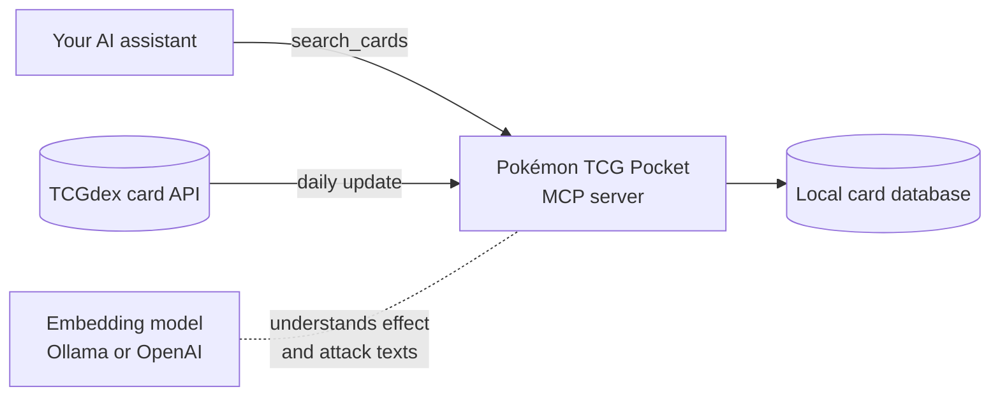

# Pokémon TCG Pocket MCP Server

**Pokémon TCG Pocket MCP Server is an open-source [Model Context Protocol](https://modelcontextprotocol.io) (MCP) server that lets AI assistants like Claude search every Pokémon TCG Pocket card by name, type, rarity, set, evolution stage, ability effect and attack, in six languages.**

Ask your AI assistant questions like _"Which Water Pokémon can heal?"_ or _"Show me all Crown rare cards from Genetic Apex"_, and it looks the answer up in a local, always up-to-date card database instead of guessing.

## Key features

- **One search tool for all cards.** Pokémon, Items, Supporters, Tools and Stadiums from every Pokémon TCG Pocket set (Genetic Apex, Mythical Island, Space-Time Smackdown and all later sets).
- **Search by meaning.** Describe an ability or attack in your own words (_"discard energy for big damage"_) and get the cards that do that, not just keyword matches.
- **Typo-tolerant names.** _"charizrd"_ still finds Charizard. Set names work the same way.
- **Exact filters.** Type (Grass, Fire, Water, ...), rarity (One Diamond to Crown), evolution stage (Basic, Stage 1, Stage 2), card category and set.
- **Six languages.** English, French, German, Spanish, Italian and Brazilian Portuguese card texts. Cards not yet translated fall back to English.
- **Always up to date.** Downloads new sets and card fixes automatically every 24 hours from [TCGdex](https://tcgdex.dev).
- **Runs locally.** Card data and search stay on your machine. Works with a free local embedding model through [Ollama](https://ollama.com), or with OpenAI.
- **Works with any MCP client.** Claude Desktop, Claude Code, Cursor, VS Code and other MCP-compatible apps, over stdio or HTTP.

## Example questions

Once connected, ask your assistant things like:

- "Find Pokémon TCG Pocket cards that heal damage from all your Pokémon."
- "Which Stage 2 Water Pokémon are there?"
- "Show me the Crown rare cards from Genetic Apex."
- "What does Glurak-ex do?" (German card names work too)
- "Which Supporter cards let me draw cards?"
- "Find Fire Pokémon whose attacks discard energy."

## How to install

You need either [Docker](https://docs.docker.com/get-docker/) or [Node.js](https://nodejs.org) 24+ with [pnpm](https://pnpm.io).

### Option 1: Docker Compose (recommended)

This runs the server, its database and a local embedding model together.

```sh
git clone https://github.com/janthoXO/pokemon-tcg-pocket-mcp.git
cd pokemon-tcg-pocket-mcp
docker compose up -d
```

The server is then available at `http://127.0.0.1:3000/mcp`. The first start downloads the embedding model (about 1 GB) and all card data, which takes a few minutes.

### Option 2: Node.js

```sh
git clone https://github.com/janthoXO/pokemon-tcg-pocket-mcp.git
cd pokemon-tcg-pocket-mcp
pnpm install
pnpm build
ollama pull bge-m3   # free local embedding model, requires Ollama
```

Your MCP client then starts the server itself (see below).

## How to connect your AI assistant

### Claude Code

With Docker Compose running:

```sh
claude mcp add --transport http pokemon-tcg-pocket http://127.0.0.1:3000/mcp
```

### Claude Desktop, Cursor and other MCP clients

Add this to your client's MCP configuration (for Claude Desktop: `claude_desktop_config.json`). Replace the path with your checkout:

```json
{
  "mcpServers": {
    "pokemon-tcg-pocket": {
      "command": "node",
      "args": ["/path/to/pokemon-tcg-pocket-mcp/dist/index.js"],
      "env": {
        "LANGUAGES": "en,de",
        "DATABASE_URL": "file:/path/to/pokemon-tcg-pocket-mcp/data/cards.db"
      }
    }
  }
}
```

Set `LANGUAGES` to the languages you want (`en`, `fr`, `de`, `es`, `it`, `pt-br`). Use an absolute `DATABASE_URL` path, because MCP clients often start the server from a different working directory. All settings are listed in the [developer guide](README_DEV.md#configuration).

## How to use the search

The server gives your assistant one tool, `search_cards`. Your assistant fills in the fields for you; you just ask in normal language. Every field except `language` is optional, and empty fields match all cards.

| Field      | What it does                              | Example              |
| ---------- | ----------------------------------------- | -------------------- |
| `language` | Language of the card texts (required)     | `en`                 |
| `name`     | Card name, typos allowed                  | `pikachu`            |
| `type`     | Pokémon type                              | `Lightning`          |
| `category` | Pokémon, Item, Supporter, Tool or Stadium | `Supporter`          |
| `stage`    | Evolution stage                           | `Stage2`             |
| `rarity`   | Card rarity                               | `Crown`              |
| `set`      | Set code or set name                      | `A1`, `Genetic Apex` |
| `effect`   | Describe an ability or trainer effect     | `heal all Pokémon`   |
| `attack`   | Describe an attack                        | `discard energy`     |
| `limit`    | Maximum number of results (1 to 50)       | `10`                 |

Each result includes the card's name, type, stage, rarity, HP, set, ability or effect text, attacks with energy cost and damage, and a card image link.

## How it works



1. **Daily update.** The server downloads all Pokémon TCG Pocket cards from the free TCGdex API and stores them in a local database. After the first download, it only fetches sets that changed.
2. **Understanding card texts.** An embedding model turns every ability and attack text into a vector, so the server can find cards by meaning, not only by exact words.
3. **Search.** Your assistant calls `search_cards`. The server filters by exact fields (type, rarity, stage, set), matches names with typo tolerance, and ranks the rest by how close the ability or attack text is to your description.

Technical details are in the [developer guide](README_DEV.md).

## Comparison

| Feature                              | This MCP server        | Calling the TCGdex API directly | Asking an AI without tools |
| ------------------------------------ | ---------------------- | ------------------------------- | -------------------------- |
| Search by ability or attack meaning  | Yes                    | No                              | Unreliable                 |
| Typo-tolerant card names             | Yes                    | No                              | Yes                        |
| Combine filters (type + stage + set) | Yes, in one call       | Several requests                | No                         |
| Includes newest sets                 | Yes, updated daily     | Yes                             | Only up to training cutoff |
| Language fallback to English         | Yes                    | No                              | Varies                     |
| Works offline after first download   | Yes (with local model) | No                              | Depends on the app         |

## Frequently asked questions

### What is an MCP server?

The [Model Context Protocol](https://modelcontextprotocol.io) is an open standard that lets AI assistants use external tools. This MCP server adds a Pokémon TCG Pocket card search tool to any assistant that supports MCP.

### Which Pokémon TCG Pocket sets are included?

All sets that TCGdex lists for Pokémon TCG Pocket, including promo sets. New sets appear automatically after the next daily update.

### Which languages are supported?

English (`en`), French (`fr`), German (`de`), Spanish (`es`), Italian (`it`) and Brazilian Portuguese (`pt-br`). If a card is not yet available in your language, you get the English text and the result is marked with `fallbackLanguage: "en"`.

### Does it cost anything?

No. The server, TCGdex and the default Ollama embedding model are free. If you choose an OpenAI embedding model instead, OpenAI charges for embeddings (well under one US dollar for the first full download).

### Does it include deck building, prices or meta statistics?

No. It is a card search. Card data comes from TCGdex, which has no prices or tournament data for Pokémon TCG Pocket.

## Limitations and security

This server is built for personal use on your own computer or a trusted network:

- The HTTP endpoint has no login. Keep it on `127.0.0.1` (the default) and do not expose it to the internet.
- Run one server per database.

Details and hardening options are in the [developer guide](README_DEV.md#security-and-limitations).

## Credits and disclaimer

Card data from [TCGdex](https://tcgdex.dev). Pokémon and Pokémon TCG Pocket are trademarks of Nintendo, Creatures and GAME FREAK. This project is not affiliated with or endorsed by The Pokémon Company, Nintendo, Creatures, GAME FREAK or DeNA.

## License

ISC, as declared in [package.json](package.json).
