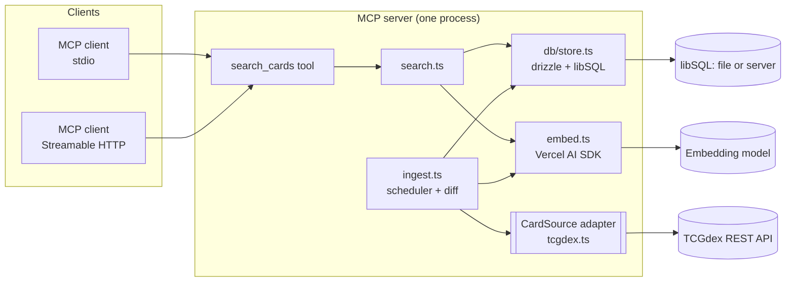

# Pokémon TCG Pocket MCP Server: Developer Guide

Technical documentation for the Pokémon TCG Pocket MCP server: architecture, configuration, data ingest, search internals, security limits and development workflow. For installation and usage, see the [README](README.md). For the full design record and decisions, see [DESIGN.md](DESIGN.md).

## Architecture overview

The server is a single Node.js process written in TypeScript. It has two paths: an **ingest path** that writes card data to the database on a schedule, and a **search path** that answers `search_cards` MCP tool calls.



## Tech stack

| Part             | Choice                                                              |
| ---------------- | ------------------------------------------------------------------- |
| Runtime          | Node.js 24+, ESM                                                    |
| Language         | TypeScript 6 (strict), compiled with `tsc` to `dist/`               |
| MCP              | `@modelcontextprotocol/sdk` (stdio and stateless Streamable HTTP)   |
| Validation       | `zod` v4                                                            |
| Database         | libSQL via `@libsql/client` (embedded file or `libsql-server`)      |
| ORM, migrations  | `drizzle-orm` + `drizzle-kit`                                       |
| Embeddings       | Vercel AI SDK (`ai`, `@ai-sdk/openai`, `@ai-sdk/openai-compatible`) |
| Fuzzy matching   | `fuse.js`                                                           |
| Card data source | [TCGdex](https://tcgdex.dev) REST API                               |
| Lint, format     | ESLint 10 + `typescript-eslint` (strict, type-aware), Prettier      |
| Tests            | `node:test` via `tsx`                                               |

## Configuration

All configuration is via environment variables; there are no CLI flags. List values are comma-separated. Invalid values stop the server at startup with a clear message.

| Variable                               | Default                     | Meaning                                                                                                                    |
| -------------------------------------- | --------------------------- | -------------------------------------------------------------------------------------------------------------------------- |
| `LANGUAGES`                            | `en`                        | Languages to ingest and serve: `en`, `fr`, `de`, `es`, `it`, `pt-br`. Example: `en,de,fr`.                                 |
| `TRANSPORTS`                           | `stdio`                     | `stdio`, `http`, or both (`stdio,http`) in one process.                                                                    |
| `PORT`                                 | `3000`                      | HTTP port, used when `TRANSPORTS` includes `http`.                                                                         |
| `HOST`                                 | `127.0.0.1`                 | HTTP bind address. The Docker image sets `0.0.0.0`.                                                                        |
| `DATABASE_URL`                         | `file:./data/cards.db`      | `file:` for an embedded database, `http(s):` or `libsql:` for libsql-server or Turso. Docker image: `file:/data/cards.db`. |
| `DATABASE_AUTH_TOKEN`                  | unset                       | JWT for a libsql-server with auth enabled.                                                                                 |
| `EMBEDDING_MODEL`                      | `compatible:bge-m3`         | `<provider>:<model>`. Provider `openai` or `compatible` (any OpenAI-compatible endpoint).                                  |
| `EMBEDDING_BASE_URL`                   | `http://localhost:11434/v1` | Endpoint for `compatible`: Ollama, LM Studio, vLLM, llama.cpp.                                                             |
| `EMBEDDING_API_KEY` / `OPENAI_API_KEY` | unset                       | API key, if the provider needs one.                                                                                        |
| `CARD_SOURCE`                          | `tcgdex`                    | Card data source adapter.                                                                                                  |
| `UPDATE_INTERVAL_HOURS`                | `24`                        | Ingest interval.                                                                                                           |
| `FULL_REFRESH_DAYS`                    | `7`                         | How often ingest re-checks every card, ignoring set fingerprints, to catch errata.                                         |

### Choosing an embedding model

`effect` and `attack` search use text embeddings. For any language other than `en`, use a **multilingual** model, because queries and card texts can be in different languages (and fallback texts are English). Good choices: `compatible:bge-m3` (Ollama, free, local) or `openai:text-embedding-3-small`. Avoid English-only models such as `nomic-embed-text`.

Changing `EMBEDDING_MODEL` is safe: the next ingest deletes all vectors and re-embeds from the stored texts without downloading cards again.

## Data ingest

Ingest runs at startup when due, then on a timer. Its state (`last_success_at`, `last_error`, languages, source, embedding model) lives in the database, so the schedule survives restarts.

Ingest is due when it never ran, when `LANGUAGES`, `CARD_SOURCE` or `EMBEDDING_MODEL` changed, when `UPDATE_INTERVAL_HOURS` passed, or one hour after a failed run.

It never wipes the database. Three hash tiers skip unchanged work:

| Tier  | Hash                                             | Skips                                  |
| ----- | ------------------------------------------------ | -------------------------------------- |
| Set   | Fingerprint over all card briefs of a set        | Downloading the set's cards            |
| Card  | Hash of canonical fields and of each translation | Database writes                        |
| Embed | Hash of the embeddable documents of a text       | Embedding calls (money on paid models) |

A normal day without a new set costs about 16 TCGdex requests per language, zero writes and zero embedding calls. Every `FULL_REFRESH_DAYS`, ingest downloads all sets again to catch text fixes that do not change the set fingerprint.

Canonical values (type, stage, rarity, category, energy cost) always come from the English record, because TCGdex localizes them inconsistently. So English is always ingested, even when `LANGUAGES` excludes it. English texts also serve as fallback for cards missing in other languages.

Each set is written in one atomic batch that includes its new fingerprint. Embedding runs afterwards in chunks of 50 texts. A crash or an unreachable embedding model loses no committed work; the next run continues.

## Search internals

1. **Hard filters in SQL:** `type`, `category`, `rarity`, `stage`, and set ids. For each card, the text row in the requested language wins; the English row is used only when the translation is missing, and the result then carries `fallbackLanguage: "en"`.
2. **Set resolution:** an exact set id (`A1`) matches directly; otherwise the set name is matched fuzzily (Fuse.js, threshold 0.4) in the requested language.
3. **Name:** fuzzy match over candidate names, threshold 0.4.
4. **Semantic ranking:** `effect` and `attack` queries are embedded once. Cosine similarity (`vector_distance_cos`) runs only over the filtered candidates, so filters never drop good matches. An attack's score is the best attack of the card. Cards without an effect (or attack) drop out of effect (or attack) queries.
5. **Score:** mean of the present similarities (name, effect, attack). Without ranking fields, results are ordered by card id and have no `score`.

Result enums are always canonical English; texts are localized.

## Database

libSQL with one drizzle schema (`src/db/schema.ts`) and one migration folder (`drizzle/`). `DATABASE_URL` alone decides between an embedded file (WAL mode) and a libsql-server container. Vectors are stored as `vector32()` blobs without a fixed dimension, so switching the embedding model needs no migration.

Tables: `sets`, `set_names`, `cards`, `card_texts`, `embeddings`, `meta`. All writes use `db.batch()`, which is atomic in file and server mode. The code does not rely on foreign key enforcement and deletes child rows explicitly.

Schema change workflow:

```sh
# edit src/db/schema.ts, then:
pnpm db:generate   # writes SQL migration to drizzle/
```

The server applies pending migrations at startup.

## Security and limitations

> [!WARNING]
> **No HTTP authentication.** Anyone who can reach the HTTP port can call `search_cards`. The server binds to `127.0.0.1` by default, and Docker Compose publishes the port on `127.0.0.1` only. Do not expose it to a public network. For remote access, put a reverse proxy with authentication in front of it.

> [!WARNING]
> **No database authentication.** The Compose `libsql` service has no auth and no published port; only containers in the Compose network can reach it. Do not publish its port. To expose it, set `SQLD_AUTH_JWT_KEY` on libsql-server and `DATABASE_AUTH_TOKEN` on the MCP server, and pass both as secrets (`.env` file or Docker secrets).

> [!WARNING]
> **Single instance only.** Run one MCP server per database. The ingest lock is in memory. Two instances on one database both run ingest: data stays consistent, but load on TCGdex doubles.

Other limits:

- Keep an embedded database file on a local disk, never on NFS or SMB shares (SQLite file locking breaks there).
- No vector index: similarity is brute force over filtered candidates, fast at the current size (about 2,500 cards).
- TCGdex has some sets only in `en` and `fr`; other languages use the English fallback for those.

## Docker

The `Dockerfile` builds a multi-stage `node:24-slim` image that runs as the `node` user with `TRANSPORTS=http`. `docker-compose.yml` runs:

| Service       | Purpose                                                   |
| ------------- | --------------------------------------------------------- |
| `mcp`         | The MCP server on `127.0.0.1:3000`, `/mcp` and `/healthz` |
| `libsql`      | libsql-server database, internal network only             |
| `ollama`      | Local embedding model server                              |
| `ollama-pull` | One-shot job that pulls `bge-m3`                          |

Variants:

- **Embedded database:** remove the `libsql` service, set `DATABASE_URL: file:/data/cards.db` on `mcp` and mount a volume at `/data`.
- **OpenAI embeddings:** remove `ollama` and `ollama-pull`, set `EMBEDDING_MODEL: openai:text-embedding-3-small` and `OPENAI_API_KEY`.
- **stdio in Docker:** `docker run -i --rm -v pocket:/data -e TRANSPORTS=stdio pokemon-tcg-pocket-mcp`.

Docker on macOS runs Ollama on CPU only; the first ingest takes several minutes, later ones only embed changed cards.

## Development

```sh
pnpm install
pnpm dev          # run from source with auto-restart (stdio by default)
```

| Command                             | Does                                                            |
| ----------------------------------- | --------------------------------------------------------------- |
| `pnpm build`                        | Compile `src/` to `dist/`.                                      |
| `pnpm start`                        | Run the compiled server.                                        |
| `pnpm dev`                          | Run TypeScript directly with `tsx`, restart on change.          |
| `pnpm typecheck`                    | Type-check without emitting.                                    |
| `pnpm lint` / `pnpm lint:fix`       | ESLint check / autofix.                                         |
| `pnpm format` / `pnpm format:check` | Prettier write / check.                                         |
| `pnpm test`                         | Run tests (in-memory database, fake source and embedder).       |
| `pnpm db:generate`                  | Generate a SQL migration from a schema change.                  |
| `pnpm db:migrate`                   | Apply migrations to `DATABASE_URL` without starting the server. |
| `pnpm check`                        | Typecheck, lint, format check and tests. Run before committing. |

Rule: log with `console.error` or `console.warn` only. stdout belongs to the stdio MCP protocol; ESLint enforces this.

### Project layout

```
src/
  index.ts          startup, MCP server, transports
  config.ts         env vars parsed with zod
  enums.ts          canonical TS enums
  embed.ts          embedding model wrapper
  ingest.ts         scheduler, hash diff, embed phase
  search.ts         search_cards logic and input schema
  db/
    client.ts       libSQL connection and migrations
    schema.ts       drizzle schema
    store.ts        typed query functions
  sources/
    types.ts        CardSource adapter interface
    tcgdex.ts       TCGdex adapter
  *.test.ts         tests
drizzle/            generated SQL migrations
```

### Adding a card source

Implement the `CardSource` interface in `src/sources/types.ts` (`listSets` returns one fingerprint per set, `fetchSet` returns normalized cards with canonical English enum values), register it in `src/index.ts`, and select it with `CARD_SOURCE`.
